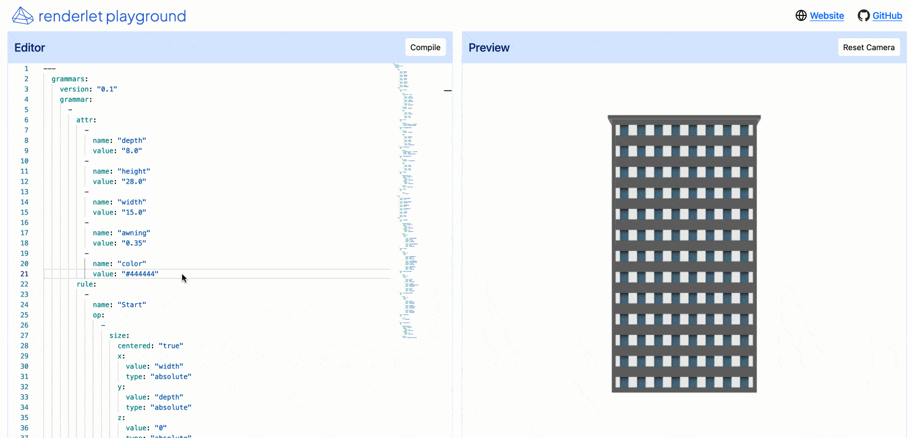

# Paint By Numbers: High Performance Drawing in Wasm

Wasm I/O 2024 presentation material by Sean Isom from renderlet.

## wander
Introducing wander: the cross platform wasm renderer.

Write graphics code once that automatically runs on any platform.

[You can find the repository for wander here.](https://github.com/renderlet/wander)

## Recording
You will find a recording of this talk here as soon as it is posted!

## Presentation
The presentation slides are available in [PaintByNumbers.pdf](PaintByNumbers.pdf)

## More info

Renderlet is building a WebAssembly framework for writing graphics code that runs anywhere.
Developers can use renderlet to embed GPU-accelerated 2D and 3D graphics into cross-platform applications.

This includes:
* A compiler that takes a high-level specification of your graphics pipeline, any assets, custom functions, and libraries, and builds self-contained WebAssembly modules
* A rendering engine, wander, that embeds into any application, on any platform, that safely runs the renderlet modules with the platform’s GPU
* A visual editor that makes it easy to compile graphics and visualization pipelines out of reusable modules

Anybody should be able to build interactive applications without having to be a graphics programming expert.  

## Example
A sample configuration / model is provided for the compiler from the talk is available in [demo.yml](demo.yml). The playground is currently in preview - please contact us for more info.

Questions? Want to learn more? Reach out - [sean@renderlet.com](mailto:sean@renderlet.com?subject=WasmIO2024)